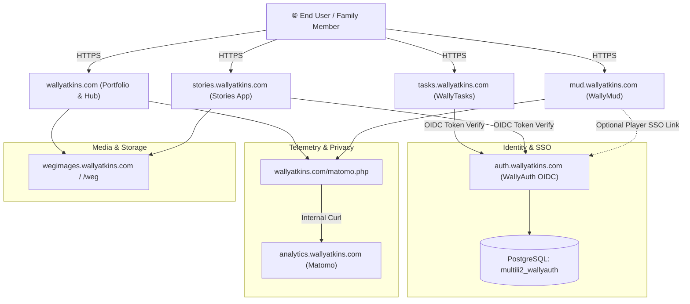

# 🌐 Atkins Digital Ecosystem — Master Architecture & Operational Blueprint

> **A Comprehensive Reference to Systems, Continuity, Deployment, Security, and Aesthetics**  
> *Author: Wally Atkins & AI Engineering Partner (Antigravity)*  
> *Last Updated: September 2026*

---

## 🧭 Executive Vision & Core Philosophy

The digital presence of **Wally Atkins** represents a deliberate, harmonious fusion of **authentic computing nostalgia** and **modern full-stack web engineering**. Rather than generic corporate templates, every site, subdomain, and service exists to solve a real need, preserve personal history, or celebrate the golden eras of software culture:

1. **1970s – 1980s Tabletop Golden Age**: TSR Advanced Dungeons & Dragons (1st/2nd Edition), rich oil cover paintings by Jeff Easley and Larry Elmore, intricate hand-drawn pen-and-ink rulebook illustrations, and tactical dungeon design.
2. **1990s BBS, Terminal & MUD Heritage**: DikuMUD (1990) and Merc 2.2 (1992–1993) text adventures, green-phosphor CRT monitors, VT100 terminal escape sequences, UNIX Pine email, and IRC chat protocols.
3. **2000s Web Nostalgia & Interactive Whimsy**: Flash animations preserved via Ruffle WebAssembly emulation, Homestar Runner and Strong Bad easter eggs (`fhqwhgads`), and the Zoltar fortune teller.
4. **2020s Modern Engineering Standards**: React 19, TypeScript, Astro 7, Vite, PHP 8.3, SQLite 3 (WAL mode), PostgreSQL 15, automated Playwright E2E tests, native PHP test suites, and strict defense-in-depth security.

---

## 🗺️ Master System Directory & Domain Topology

All web applications are hosted on Bluehost enterprise shared hosting (`box5933.bluehost.com`, user: `multili2`, primary IP: `50.116.64.32`, OS: Enterprise Linux kernel 5.14) and managed via GitHub (`@wallyatkins`).

| Domain / Subdomain | Server Path | Tech Stack | Database | Purpose & Description |
|:---|:---|:---|:---|:---|
| **`wallyatkins.com`** | `/home4/multili2/public_html/wallyatkins` | React 19, TypeScript, Vite, PHP 8.3 | MySQL `multili2_wallyatkins` (Blog) | **Core Portfolio & Creative Portal**. Dual "Professional" and "Creative" modes, playable Snake game, Ruffle Flash player, Pine contact form, and hidden Easter eggs. |
| **`mud.wallyatkins.com`** | `/home4/multili2/public_html/wallymud` | Pure PHP 8.3, Vanilla HTML5/CSS3 CRT Terminal | SQLite 3 (`wallymud.sqlite`, WAL mode) | **WallyMud (Merc Diku MUD 2.2)**. Zero-dependency browser-accessible text MUD with 43 classic zones, THAC0 combat, dynamic lazy ticks, and interactive `/areas` atlas. |
| **`auth.wallyatkins.com`** | `/home4/multili2/public_html/wallyauth` | PHP OIDC / OAuth 2.0 Server | PostgreSQL `multili2_wallyauth` | **Central Identity & Single Sign-On (SSO)**. Issues secure JWT/OIDC tokens for WallyTasks, Stories, and WallyMud registered characters. |
| **`tasks.wallyatkins.com`** | `/home4/multili2/public_html/wallytasks` | Astro 7, PHP API, Tailwind CSS | PostgreSQL `multili2_tasks` | **Family Task & Productivity Hub**. Task boards, comment threads, attachments, and user roles authenticated via WallyAuth. |
| **`stories.wallyatkins.com`** | `/home4/multili2/public_html/website_66965144` | React Frontend, PHP API | PostgreSQL `multili2_stories` | **Family Memory & Storytelling Archive**. Preserves family anecdotes, oral histories, photo attachments, and timelines. |
| **`family.wallyatkins.com`** | `/home4/multili2/public_html/family` | MediaWiki 1.43, PHP 8.2 | MySQL `multili2_family_wiki` | **Private Family Encyclopedia**. Detailed genealogical records, historical documents, photo archives, and family wiki pages. |
| **`vhsl.wallyatkins.com`** | `/home4/multili2/public_html/vhsl_wallyatkins` | Static HTML5 / Modern JS | None (Static / JSON) | **Virginia High School League Sports Tracker**. Volleyball schedules, bracket standings, and match statistics. |
| **`volleyball.wallyatkins.com`** | `/home4/multili2/volleyball_wallyatkins` | Static HTML / PHP Portal | None (Static) | **Volleyball Coaching & Clinics**. Player development resources, drill diagrams, and tournament schedules. |
| **`analytics.wallyatkins.com`** | `/home4/multili2/public_html/analytics` | Matomo Analytics Platform, PHP 8.2 | MySQL | **Self-Hosted Privacy Telemetry**. Private, cookie-less website visitor statistics isolated from commercial tracking networks. |
| **`wegimages.wallyatkins.com`** | `/home4/multili2/wegimages.wallyatkins.com` | Nginx/Apache Media Repository | None (Flat Asset Storage) | **High-Capacity Media CDN**. Houses over 8,000 photos and high-resolution media assets (1.4 GB) served across web apps. |
| **`360tourdesigns.wallyatkins.com`** | `/home4/multili2/public_html/360tourdesigns` | PHP API, Automated Crontab | None (JSON / External API) | **Tour Appointment Synchronizer**. Syncs real estate photography tour schedules nightly at 2:00 AM. |
| **`wheres.wallyatkins.com`** | `/home4/multili2/public_html/whereswally` | Lightweight PHP / Geolocation | Local JSON Data | **Personal Geolocation & Travel Tracker**. Private location presence updater for family. |
| **Family Subdomains** (`derek`, `logan`, `hunt`, `tabb`) | `/home4/multili2/public_html/{name}` | Lightweight Static HTML / PHP | None | **Personal Family Landing Pages**. Dedicated subdomains for individual family members. |

---

## 🔗 Continuity & Inter-Service Architecture



### 1. Unified Authentication (WallyAuth)
* **Standard**: OpenID Connect (OIDC) & OAuth 2.0 with JWT access and refresh tokens.
* **Flow**: Authorization Code Flow with PKCE for web clients.
* **Database**: PostgreSQL (`multili2_wallyauth`) with tables `oauth_users`, `oauth_roles`, `oauth_access_tokens`, and `device_trust`.
* **Guest Compatibility**: Apps like WallyMud allow instant guest entry, while providing `/claim` or login commands to bind characters to WallyAuth credentials.

### 2. Privacy-Preserving Telemetry (Matomo Reverse Proxy)
* **Mechanism**: To bypass aggressive adblockers and protect visitor privacy, traffic logs through `wallyatkins.com/matomo.php` which executes `matomo-proxy-logic.php`.
* **Headers**: Sanitizes `X-Forwarded-For`, strips sensitive cookies, and proxies payloads directly to `analytics.wallyatkins.com` over the local server loopback.

---

## 🛠️ Development, Testing & Deployment Protocols

### 1. Local Development Environment
* **Platform**: WSL (Windows Subsystem for Linux, Ubuntu 22.04 / 24.04).
* **Node Environment**: Node Version Switcher (`nvs`), running Node LTS (v20+ / v22+).
* **PHP Runtime**: PHP 8.3 CLI with `pdo_sqlite`, `pdo_pgsql`, `pdo_mysql`, and `gd` extensions.
* **Containerized Dev**: VS Code `.devcontainer` and Docker Compose for Apache/PHP parity.

### 2. Version Control & Git Strategy
* **Organization**: GitHub user `@wallyatkins`.
* **Branching**: `main` is production-ready at all times. Feature branches for major overhauls.
* **Commit Conventions**: Strict semantic prefixing (`feat:`, `fix:`, `docs:`, `test:`, `refactor:`).

### 3. Automated Quality Assurance & Testing Suites
* **WallyMud Test Suite** (`WallyMud/tests/`):
  * **Zero-Dependency CLI Runner**: Executable via `php tests/run_tests.php` anywhere (no Composer/NPM required).
  * **Test Count**: **45 test methods**, **677 assertions**, covering:
    * `DiceTest`: Range bounds, formula strings (`3d6+4`, `2d8-3`), flat modifiers.
    * `FormulasTest`: THAC0 curve (Level 0 to 32), damage verbs (`scratches` to `ANNIHILATES`), XP reward curves, HP/Mana/Move regen rates.
    * `AreaFileReaderTest`: Authentic Merc `.are` file stream parser, tilde strings, `#AREA`, `#ROOMS`, `#MOBILES`, `#OBJECTS`, `#RESETS`, `#SHOPS`.
    * `CharacterTest`: Serialization, level thresholds, attributes, vitals clamping.
    * `MobInstanceTest`: Stat rolling, aggressive flags, spec functions.
    * `RoomTest`: Arena boundaries, safe zones (Temple, Colosseum, Mud School), exit mappings.
    * `ItemInstanceTest`: Wear flags, equipment slots, custom corpses.
    * `TickManagerTest`: 60-second regen pulses, 120-second MUD hours, lazy catch-up.
    * `CombatEngineTest`: Multi-attacks, THAC0 vs AC checks, death and corpse generation.
    * `InterpTest`: Command parsing, prefix abbreviation, state restrictions.
    * `AreaServiceTest`: Complete dossier hydration, BFS 2D/3D spatial map computation, world map hubs.
* **Portfolio E2E Test Suite** (`website/tests/`):
  * **Playwright Suite**: Tests Snake game controls, gesture triggers, Konami code, and mocked contact form submissions.

### 4. Deployment Workflows
* **Frontend React / Astro**:
  1. Build bundle: `npm run build` -> outputs to `dist/`.
  2. Copy PHP contact endpoints (`pine.php`, `utils.php`) and `.htaccess` into `dist/`.
  3. Deploy via GitHub Actions workflow (`.github/workflows/deploy.yml`) over secure FTP/SSH.
* **Backend PHP / WallyMud**:
  * Synced via `rsync` or git deployment to `/home4/multili2/public_html/wallymud`.
  * Preserves production SQLite database (`data/wallymud.sqlite`) and logs.
  * Web root is protected via `.htaccess`.

---

## 🔒 Security Policies & Hardening Guidelines

### 1. Server & Directory Access Control
* **Web Root Separation**: Public web requests only serve `/public` or `dist/`. Core PHP logic (`/src`), game data (`/data`), and temporary stores (`/var`) reside outside public roots or are blocked by Apache `.htaccess`:
  ```apache
  <FilesMatch "\.(sqlite|db|log|env|json|lock|are|md|git.*)$">
      Require all denied
  </FilesMatch>
  ```
* **Directory Indexing**: `Options -Indexes` enforced across all subdomains to prevent directory listing.

### 2. Database Protection
* **Strict Parameterized Queries**: All database interactions across SQLite, PostgreSQL, and MySQL use PDO prepared statements with parameter binding. Zero raw SQL string interpolation.
* **SQLite WAL Isolation**: `wallymud.sqlite` operates in `PRAGMA journal_mode = WAL` with `PRAGMA synchronous = NORMAL` and 5000ms busy timeouts for concurrency without lock contention.
* **PostgreSQL Isolation**: Dedicated database users (`multili2_tasks`, `multili2_pg_wally_auth`, `multili2_stories`) with minimum necessary table permissions.

### 3. Contact Form & Anti-Spam Safeguards (`pine.php`)
* **Honeypot Trap**: Invisible field for automated bots. Submissions with filled honeypots are silently dropped with an HTTP 200 OK to waste bot resources.
* **Time Trap**: Rejects submissions completed faster than 3 seconds (inhuman typing speed).
* **Header Injection Cleansing**: Sanitizes newlines in email headers (`\r`, `\n`) to prevent SMTP relay hijacking.

### 4. Production Error Management
* **Zero Stack-Trace Leakage**: `ini_set('display_errors', '0')` in `bootstrap.php`. All fatal exceptions and PDO errors are logged to internal log files (`error_log`) and never rendered to users.

---

## 🎨 Style, Theming, Inspiration & Lore

### 1. Jeff Easley TSR AD&D Aesthetic
* **Scenic Philosophy**: WallyMud areas are conceived not just as rooms in a database, but as classic TSR D&D adventure modules (like *The Temple of Elemental Evil* or *Queen of the Demonweb Pits*).
* **Color Palette**: Moody twilight blues, molten torchlight oranges, deep sepia parchment, and heavy chiaroscuro contrasts.
* **Art Prompt Standards**: All 43 areas feature calibrated prompts for:
  * Master Area Cover Art (Full-color oil painting, 16:9).
  * Dynamic Action & Encounter Painting (16:9).
  * Landmark Interior / Deep Chamber (16:9).
  * Inline Rulebook Ink & Wash Sketches (Black & white pen and ink, 4:3).

### 2. Retro CRT Terminal Interface
* **Phosphor Glow**: Authentic VT100 monochrome and amber CRT styling with CSS scanlines and subtle radial distortion.
* **Color Tokens**: ANSI color codes mapped to classic Merc color tokens (`{r` red, `{g` green, `{y` yellow, `{b` blue, `{m` magenta, `{c` cyan, `{w` white, `{R` bold red, `{W` bold white).
* **Keyboard Ergonomics**: Full terminal history buffer (Up/Down arrows), Tab auto-completion, dynamic prompt updating with vitals.

### 3. Easter Eggs & Web Whimsy
* **Konami Code & D-Pad**: Unlocks the retro arcade Snake game in `wallyatkins.com`.
* **"fhqwhgads"**: Nostalgic tribute to Homestar Runner and Strong Bad email animations.
* **Zoltar Fortune Teller**: Animated mystical automaton offering witty, mysterious fortunes.
* **Pine Email Client**: Contact form styled as the legendary University of Washington 1989 text-based email client.

---

## 📋 Comprehensive 43-Area MUD Realm Atlas

All 43 areas are fully cataloged in `WallyMud/docs/areas/` with bespoke lore, statistics, and Jeff Easley scenic guides:

| ID | Area Name | Category | Danger Level | Rooms | VNUM Range | Historical Origin |
|:---|:---|:---|:---|:---|:---|:---|
| 2 | **Limbo** | Arcane & Planar | Dimensional Void (1 - 35) | 2 | 1 - 2 | DikuMUD (1990) Purgatory & Puff |
| 3 | **Smurf Village** | Wilderness & Forests | Novice Woods (1 - 10) | 29 | 101 - 129 | Classic 90s Parody Training Ground |
| 4 | **Plains of the North** | Wilderness & Forests | Overland Steppes (1 - 20) | 44 | 300 - 345 | Copper (1993) Merc Frontier |
| 5 | **New Ofcol** | Cities & Kingdoms | Mountain Stronghold (5 - 35) | 100 | 600 - 699 | Hatchet (1993) Alpine Expansion |
| 6 | **Mount Olympus** | Arcane & Planar | Mythic Realm (5 - 30) | 50 | 901 - 954 | Generic Diku Greek Pantheon |
| 7 | **In the Air** | Arcane & Planar | Aerial Spire (5 - 10) | 40 | 1001 - 1040 | Copper (1993) Griffin Cloudscape |
| 8 | **The Shire of the Halflings** | Wilderness & Forests | Peaceful Meadows (5 - 35) | 58 | 1100 - 1157 | Tolkien-inspired Hobbit Shire |
| 9 | **The High Tower of Sorcery** | Arcane & Planar | Arcane Spire (10 - 30) | 184 | 1200 - 1499 | Dragonlance High Sorcery Citadel |
| 10 | **Gnome Village** | Dungeons & Deeps | Subterranean Warren (5 - 15) | 89 | 1501 - 1590 | Vougon (1993) Tinker Caverns |
| 11 | **Wyvern's Tower** | Ruins & Crypts | Haunted Spire (5 - 30) | 61 | 1601 - 1720 | Tyrst (1993) Venomous Mountain Keep |
| 12 | **Dwarven Catacombs** | Ruins & Crypts | Ancient Necropolis (10 - 20) | 69 | 2001 - 2069 | Raff (1993) Dark Underdark Crypts |
| 13 | **Dangerous Neighborhood** | Cities & Kingdoms | Urban Slums (5 - 15) | 72 | 2101 - 2172 | Raff (1993) Gritty City Gangland |
| 14 | **The Dragon Tower of Draconia** | Arcane & Planar | Wyrm Roost (5 - 30) | 44 | 2201 - 2244 | Wench (1993) Chromatic Drakes |
| 15 | **The Keep of Mahn-Tor** | Dungeons & Deeps | Minotaur Stronghold (5 - 35) | 100 | 2300 - 2399 | Chris (1993) Minotaur Labyrinth |
| 16 | **Troll Den** | Dungeons & Deeps | Beast Lair (10 - 15) | 5 | 2801 - 2805 | Merc Diku Regenerating Trolls |
| 17 | **Land of the Fire Newts** | Dungeons & Deeps | Volcanic Wasteland (5 - 15) | 32 | 2900 - 2931 | Nirrad (1993) Fiend Folio Geothermal |
| 18 | **The Imperial City of Midgaard** | Cities & Kingdoms | Civilized Hub (1 - 35) | 108 | 3001 - 3205 | Diku (1990) & Merc 2.0 (1993) Nexus |
| 19 | **The Chapel Catacombs** | Ruins & Crypts | Unholy Crypts (15 - 25) | 67 | 3405 - 3475 | Copper (1993) Gothic Undead Abbey |
| 20 | **The Dark Forest of Miden'nir** | Wilderness & Forests | Overland Wilderness (5 - 15) | 45 | 3500 - 3584 | Copper (1993) Southern Pine Woods |
| 21 | **The Old Midgaard Graveyard** | Ruins & Crypts | Haunted Grounds (5 - 10) | 33 | 3600 - 3651 | Alfa (1991) Cemetery & Crypts |
| 22 | **The Mud School of Kahn** | Academies & Trials | Newbie Academy (1 - 5) | 59 | 3700 - 3760 | Hatchet (1993) Groundbreaking Tutorial |
| 23 | **The Mines of Moria** | Dungeons & Deeps | Perilous Underdark (5 - 15) | 121 | 3900 - 4172 | Alfa (1991) Tolkien Underworld |
| 24 | **Kingdom of Juargan** | Cities & Kingdoms | Subterranean Empire (10 - 25) | 86 | 4700 - 4785 | Ancient Deep Dwarven Bastion |
| 25 | **Great Eastern Desert** | Wilderness & Forests | Arid Desolation (10 - 20) | 47 | 5001 - 5070 | Brass Dragon & Dracolich Wastes |
| 26 | **Drow City** | Dungeons & Deeps | Underdark Metropolis (15 - 25) | 51 | 5100 - 5150 | Salvatore Menzoberranzan Homage |
| 27 | **The Desert Jewel of Thalos** | Cities & Kingdoms | Desert Metropolis (10 - 25) | 80 | 5200 - 5280 | Arabian Nights Oasis Capital |
| 28 | **The Sunken Ruins of Old Thalos**| Ruins & Crypts | Ruined City (1 - 30) | 86 | 5300 - 5386 | Kahn (1993) Mirror Puzzle Ruins |
| 29 | **Ofcol** | Cities & Kingdoms | Peaceful Haven (1 - 35) | 8 | 5550 - 5577 | Alfa (1991) Original Mountain Haven |
| 30 | **The Ancient Forest of Haon-Dor**| Wilderness & Forests | Ancient Canopy (5 - 10) | 71 | 6000 - 6155 | Diku Primordial Western Forest |
| 31 | **The Webbed Lair of Arachnos** | Dungeons & Deeps | Deadly Caverns (5 - 20) | 56 | 6200 - 6399 | Silk Labyrinth & Spider Queen |
| 32 | **The Mountain Citadel of Dwarves**| Cities & Kingdoms | Mountain Stronghold (10 - 25) | 50 | 6500 - 6554 | High Dwarven Forges & King's Hall |
| 33 | **Dwarven Day Care** | Dungeons & Deeps | Whimsical Delve (1 - 5) | 19 | 6601 - 6631 | Sandman (1993) Parody Nursery |
| 34 | **The Sewers of Midgaard** | Dungeons & Deeps | Murky Undercity (5 - 30) | 177 | 7001 - 7445 | Diku (1990) Sprawling Aqueduct Maze |
| 35 | **The Enchanted Valley of Elves** | Wilderness & Forests | Mystic Glade (5 - 20) | 84 | 7800 - 7883 | Hatchet (1993) Silverwood Canopy |
| 36 | **Redferne's Residence** | Ruins & Crypts | High Manor (20 - 30) | 17 | 7900 - 7918 | Diku Paladin Lord's Estate |
| 37 | **Mega-City One** | Arcane & Planar | Cyber-Dystopia (5 - 35) | 28 | 8001 - 8028 | Glop (1993) Judge Dredd Crossover |
| 38 | **Old Marsh** | Wilderness & Forests | Murky Swamplands (15 - 25) | 18 | 8301 - 8318 | Diku Mire & The Swamp Thing |
| 39 | **Machine Dreams** | Arcane & Planar | Surreal Oneiric Realm (1 - 5) | 36 | 8600 - 8699 | Furey (1993) Clockwork Dreamscape |
| 40 | **Holy Grove** | Wilderness & Forests | Sacred Sanctuary (5 - 20) | 20 | 8901 - 8999 | Alfa (1991) Nature Druid Circle |
| 41 | **Dylan's Area** | Arcane & Planar | Enchanted Fairyland (15 - 25) | 88 | 9101 - 9199 | Dylan (1993) Beanstalk & Cloud Castle |
| 42 | **The Elemental Canyon** | Arcane & Planar | Prismatic Chasm (5 - 30) | 55 | 9201 - 9260 | Raff (1993) 4-Quadrant Elemental Rift |
| 43 | **The Astral Galaxy** | Arcane & Planar | Cosmic Void (20 - 30) | 61 | 9301 - 9371 | Doctor (1993) Celestial Milky Way |
| 44 | **Mob Factory** | Arcane & Planar | Satirical Meta-Delve (5 - 35) | 25 | 9400 - 9424 | PinkF (1993) Mob Assembly Line |

---

## 🚀 Operational Checklist for Future Sessions

1. **Local Test Verification**: Always run `php tests/run_tests.php` inside `WallyMud` after any core engine or handler changes.
2. **Database Integrity**: Never drop Docker volumes without explicit intent; always use SQLite WAL transactions.
3. **Safe Deployments**: Stage assets and verify PHP syntax (`php -l`) prior to deploying via FTP/SSH to Bluehost.
4. **Consistency Enforcement**: Ensure new areas or features adhere to the Jeff Easley AD&D aesthetic guide and Merc 2.2 mathematical formulas.
